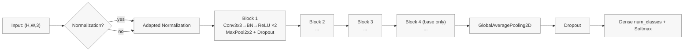

# CNN Architecture (leaf_cnn)

This document describes the `leaf_cnn` network (defined in `srcs/model/cnn.py`) and the reasoning behind key choices.

## Overview

- Input: `(img_size, img_size, 3)` (default 224×224×3)
- Optional data-adapted normalization (`layers.Normalization`)
- 3–4 convolutional blocks (scale-dependent) with increasing channels
- Head: `GlobalAveragePooling2D → Dropout → Dense(num_classes, softmax)`

## Diagram

## Rationale

- Two 3×3 convolutions per block: larger effective receptive field with moderate cost.
- BatchNorm after conv: stable optimization, works well with mixed precision.
- GlobalAveragePooling: fewer parameters than Flatten+Dense; reduces overfitting.
- Dropout in blocks and head: light regularization.
- Optional depthwise-separable mode for lighter compute.

## Presets

- tiny: widths=[16,32,64], drop_block=0.10, drop_top=0.30
- small: widths=[32,64,128], drop_block=0.15, drop_top=0.35
- base: widths=[32,64,128,256], drop_block=0.15, drop_top=0.40

## Interactions

- Mixed precision is enabled by default; normalization helps numerical stability.
- EMA weights are evaluated post-training; only the best variant (base or EMA) is saved.

## Code

- Model and normalization: `srcs/model/cnn.py`
- Training and callbacks: `srcs/cli/train.py`, `srcs/train/utils.py`
- Data loading: `srcs/dataio/sequence.py`
